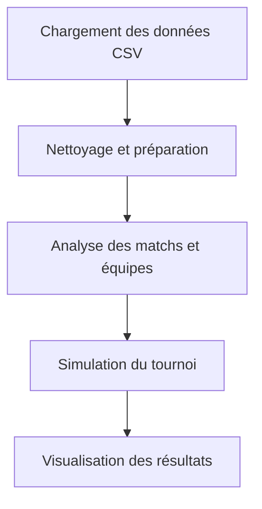
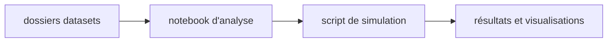

# World Cup 2026 Simulation

Ce projet vise à analyser des données footballistiques liées à la Coupe du Monde 2026 et à construire une simulation de tournoi à partir de fichiers CSV, d’un notebook Jupyter et d’un script Python.

## Objectif du projet

Le repository combine plusieurs étapes classiques d’un workflow de data science :
- collecte et nettoyage de données,
- exploration des matchs et des équipes,
- préparation des jeux de données,
- simulation de phases de groupe et d’éliminatoires,
- visualisation et présentation des résultats.

L’objectif est de fournir un exemple simple mais structuré de projet Python orienté sport analytics.

## Ce qui est utilisé dans le projet

### Langages et bibliothèques

Le projet repose principalement sur :
- Python 3
- pandas pour la manipulation des données
- numpy pour les calculs numériques
- matplotlib pour la visualisation
- joblib pour la sérialisation de modèles ou de variables
- Jupyter Notebook pour l’exploration interactive

### Fichiers principaux

- datasets/ : contient les données sources utilisées par l’analyse
- notebooks/02_API_Data_Collection.ipynb : notebook principal d’exploration et de traitement
- notebooks/worldcup2026_full_tournament_simulation.py : version script du workflow de simulation

### Données utilisées

Le dossier datasets contient plusieurs fichiers CSV, notamment :
- competitions.csv
- matches.csv
- teams.csv
- results_clean.csv
- team_statistics.csv
- round16_predictions_v1.csv

Ces fichiers servent à analyser les matchs, les résultats, les groupes et les performances des équipes.

## Structure du repository

- README.md : documentation du projet
- requirements.txt : dépendances Python nécessaires
- .gitignore : fichiers à ignorer dans Git
- datasets/ : fichiers de données
- notebooks/ : notebooks et scripts Python

## Prérequis

Avant de commencer, assurez-vous d’avoir :
- Python 3.9 ou plus récent
- un environnement virtuel recommandé
- les dépendances listées dans requirements.txt

## Installation

Créez un environnement virtuel puis installez les dépendances :

```bash
python -m venv .venv
source .venv/bin/activate
pip install -r requirements.txt
```

Sous Windows PowerShell :

```powershell
.venv\Scripts\Activate.ps1
pip install -r requirements.txt
```

## Utilisation du notebook

Pour ouvrir et explorer le notebook :

```bash
jupyter notebook notebooks/02_API_Data_Collection.ipynb
```

Le notebook est utile pour :
- charger les jeux de données,
- nettoyer et préparer les données,
- tester différentes transformations,
- visualiser les résultats de manière interactive.

### Schéma du workflow



### Structure logique du projet



## Utilisation du script Python

Pour exécuter la version script du projet :

```bash
python notebooks/worldcup2026_full_tournament_simulation.py
```

## Points à noter

Le script Python a été écrit dans un contexte proche de Google Colab et peut contenir des chemins absolus ou des références spécifiques à cet environnement. Pour une utilisation locale plus robuste, il peut être nécessaire de :
- remplacer les chemins absolus par des chemins relatifs,
- vérifier que les fichiers CSV sont bien présents dans datasets/,
- adapter les imports si votre structure de dossier diffère.

## Dépendances Python

Les bibliothèques principales sont listées dans requirements.txt. Elles couvrent :
- la manipulation de données,
- les calculs numériques,
- la visualisation,
- l’exécution de notebooks Jupyter.

## Contribution

Les contributions sont encouragées. Vous pouvez proposer des améliorations, ajouter de nouvelles analyses, enrichir la simulation ou nettoyer le code.
